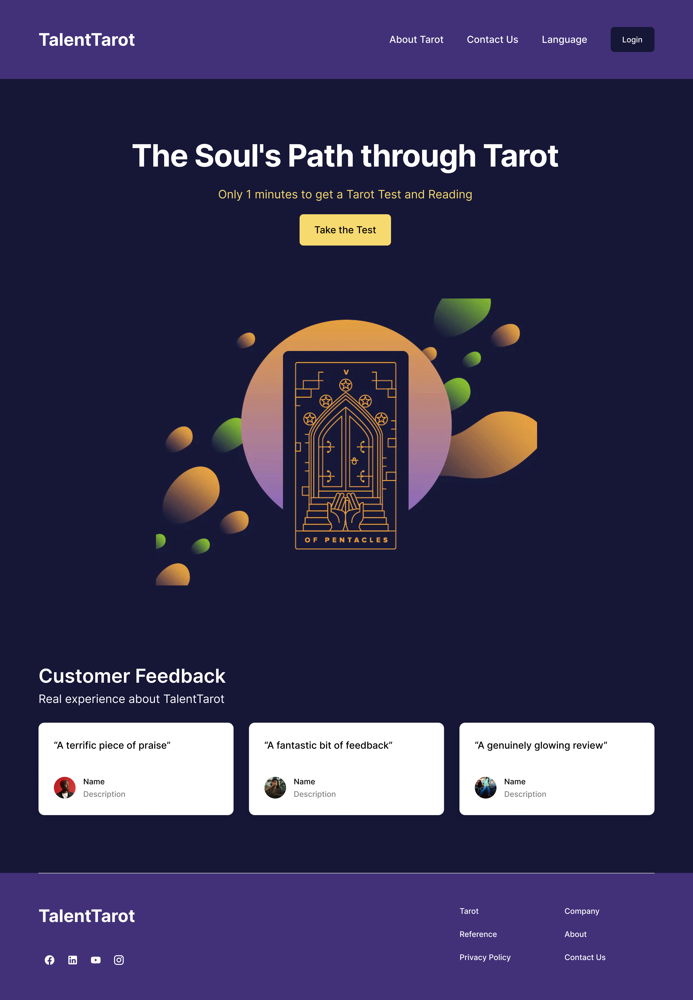
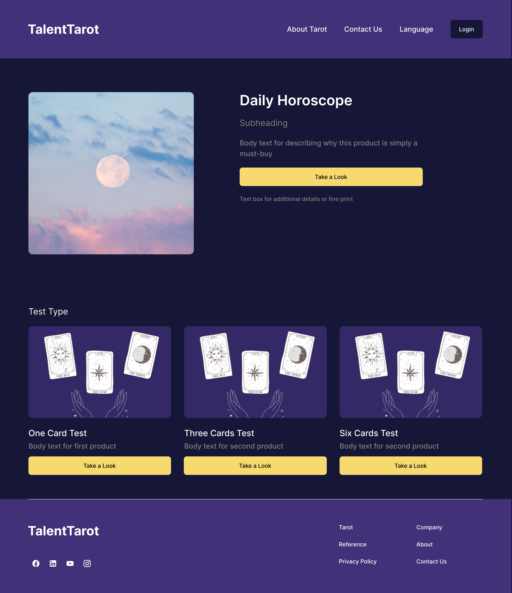
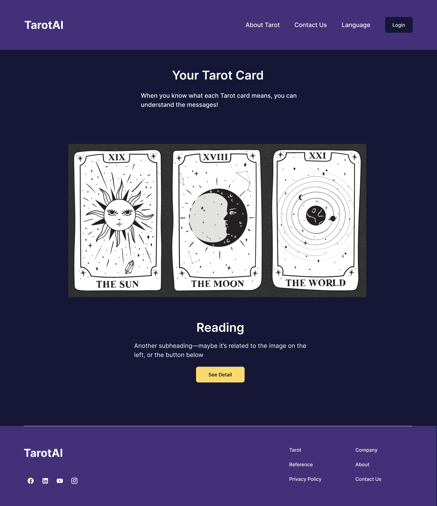

# TalentTarot
✨ Build a Tarot Testing and Reading website.

## Business Idea：
Create a website and app featuring a simple interface that uses virtual Tarot cards for online readings. By integrating AI technology, we aim to make the Tarot reading process and interpretation more professional and accurate.

 Design tools: Figma 

 Front-end: React Native 

 Back-end: MySQL etc.. 

## Function

  <h3>Opening Page:</h3>
  
Display a Tarot card graphic along with user feedback.

  
  <h3>Main Page:</h3>
  
Show the daily horoscope and offer three types of Tarot card readings to choose from.

  
  <h3>Three-Card Reading Page:</h3>
  
Present the reading results with an option to click "Detail" to view a more detailed prediction for a fee.

  

